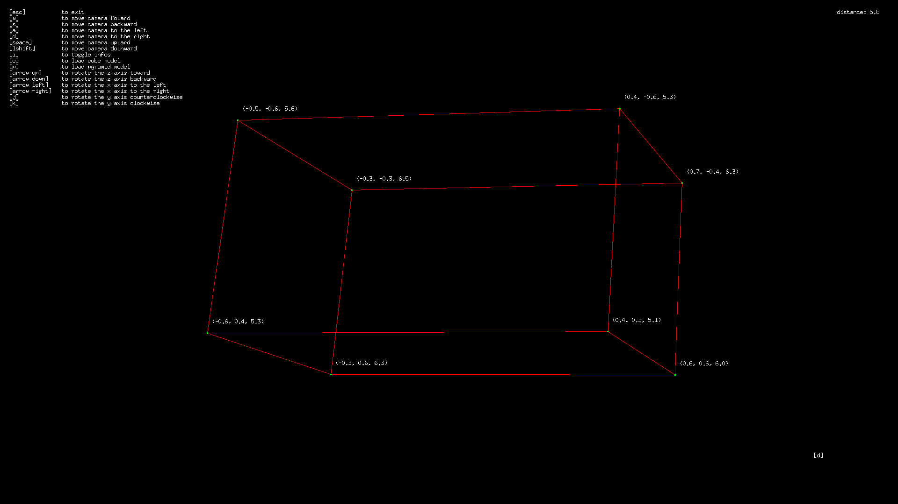

## Video

<p>click to watch the video</p>

<div align="center">
  <a href="https://www.youtube.com/watch?v=9L8lAzFhXFo">
    
  </a>
</div>

## Installation

### Prerequisites

- [go](https://golang.org/dl/) version 1.21.5 or later

```bash
# clone the repo
git clone https://github.com/kevindotklein/go-3d-renderer.git

# navigate to directory
cd go-3d-renderer

# download modules
go mod download

# build
go build -o main ./cmd/renderer/main.go

# run
./main
```
